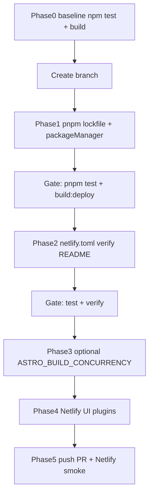

# pnpm migration, Netlify alignment, and build-speed — full implementation plan

> **For agentic workers:** Implement with `superpowers:subagent-driven-development` or `superpowers:executing-plans`. Complete phases in order; **do not skip testing gates**. Steps use `- [ ]` checkboxes.

**Goal:** Move the project from **npm** + `package-lock.json` to **pnpm** + `pnpm-lock.yaml`, update [netlify.toml](netlify.toml) and [package.json](package.json) so production builds use `pnpm`, keep **TinaCMS** and **Astro** behavior unchanged, and apply safe **build-speed** tweaks. **Nothing that works today should regress** (tests, local build, Netlify deploy, Tina admin).

**Safety principles**

1. **Baseline first:** Record passing commands and test counts *before* changing the package manager.
2. **Feature branch:** Do migration work on a branch until all gates pass; merge only after Netlify production deploy is verified.
3. **One logical change per commit** (or small commits): e.g. lockfile + `packageManager`, then `netlify.toml`, then README, then concurrency.
4. **Rollback path:** Keep git history clean so reverting a merge restores npm + `package-lock.json` if needed.
5. **Tina env unchanged:** `PUBLIC_TINA_CLIENT_ID` and `TINA_TOKEN` stay in Netlify and `.env` — no Tina Cloud dashboard changes for pnpm.

**Architecture:** Single package at repo root. Netlify detects `pnpm-lock.yaml` and runs `pnpm install` (with frozen lockfile in CI semantics). [netlify/plugins/cache-astro-vite/index.cjs](netlify/plugins/cache-astro-vite/index.cjs) continues to cache `node_modules/.astro` and `node_modules/.vite` after install. Corepack + `"packageManager"` in [package.json](package.json) pins the pnpm version for local and Netlify Node 22.

**Tech stack:** Node `>=22.12.0` ([package.json](package.json) `engines`), pnpm 9.x (pin exact), Astro 6, `@tinacms/cli`, Netlify.

**Out of scope**

- Running **`astro build` with Bun** as the runtime.
- **Conditional skip of `tinacms build`** (high risk of stale `tina/__generated__` / admin). Defer to a follow-up plan with its own review.
- Adding new GitHub Actions (repo has no `.github/workflows` today).

---

## Files that will change (reference)

| Path | Change |
|------|--------|
| [package.json](package.json) | Add `"packageManager": "pnpm@X.Y.Z"`; update `verify` to use `pnpm`; scripts unchanged otherwise |
| `pnpm-lock.yaml` | **Add** (committed) |
| `package-lock.json` | **Remove** |
| [.gitignore](.gitignore) | No change (`pnpm-lock.yaml` is not ignored) |
| `.npmrc` | **Optional** — only if a dependency fails under pnpm strictness |
| [netlify.toml](netlify.toml) | `command = "pnpm run build:deploy"`; comments updated; optional `ASTRO_BUILD_CONCURRENCY` |
| [README.md](README.md) | Replace npm examples with pnpm + Corepack note |
| [docs/superpowers/plans/2026-04-07-pnpm-netlify-build-implementation.md](docs/superpowers/plans/2026-04-07-pnpm-netlify-build-implementation.md) | This file (no further rename) |

**Tina / Netlify:** No [tina/config.ts](tina/config.ts) edits for pnpm. Netlify UI: confirm no custom **Install command** override; optionally adjust build plugins (see Phase 4).

---

## Phase 0: Baseline testing and branch (mandatory)

**Purpose:** Prove the repo is healthy **before** any migration so regressions are obvious.

- [ ] **Step 0.1:** Ensure clean tree or stash unrelated work; you are on `main` and pulled latest.

```bash
git status
git pull origin main
```

- [ ] **Step 0.2:** Install with **npm** (current workflow) and run unit tests.

```bash
rm -rf node_modules
npm ci
npm test
```

**Record here (copy actual output):**

- Test files: `__` passed ( `__` total tests )
- Exit code: `0`

- [ ] **Step 0.3:** Production-style build **locally** (requires `.env` with `PUBLIC_TINA_CLIENT_ID` and `TINA_TOKEN` or `TINA_TOKEN_LOCAL` per [.env.example](.env.example)).

```bash
npm run build:deploy
```

**Gate:** Command exits `0`. `dist/index.html` exists; at least one program route under `dist/programs/`.

- [ ] **Step 0.4 (recommended):** E2E if you have Playwright browsers installed and time.

```bash
npm run test:e2e
```

If skipped, note: "E2E skipped (reason: ___)."

- [ ] **Step 0.5:** Create feature branch.

```bash
git checkout -b chore/pnpm-and-netlify-build
```

**Commit:** No commit in Phase 0 unless you need to save unrelated work.

---

## Phase 1: Migrate to pnpm (lockfile + packageManager)

- [ ] **Step 1.1:** Enable Corepack (local dev; Netlify uses Node 22 + `packageManager`).

```bash
corepack enable
```

- [ ] **Step 1.2:** Install pnpm globally if needed (or use `corepack prepare pnpm@latest -a`).

```bash
pnpm --version
```

- [ ] **Step 1.3:** From repo root **with** existing `package-lock.json`:

```bash
rm -rf node_modules
pnpm import
pnpm install
```

If `pnpm import` fails, delete `package-lock.json` only after backing up (`cp package-lock.json /tmp/`), then `pnpm install` and diff dependency intent carefully.

- [ ] **Step 1.4:** Add **exact** `packageManager` to [package.json](package.json) (use output of `pnpm --version`):

```json
"packageManager": "pnpm@9.x.x"
```

- [ ] **Step 1.5:** Remove npm lockfile from git tracking.

```bash
git rm package-lock.json
git add pnpm-lock.yaml package.json
```

- [ ] **Step 1.6 — Gate: clean install + tests**

```bash
rm -rf node_modules
pnpm install --frozen-lockfile
pnpm test
```

**Expected:** Same number of test files and tests as Phase 0 (or document any intentional delta).

- [ ] **Step 1.7 — Gate: deploy build**

```bash
pnpm run build:deploy
```

**Expected:** Exit `0`; `dist/` complete as in Phase 0.

- [ ] **Step 1.8 (optional):** `pnpm run test:e2e` if run in Phase 0.

- [ ] **Step 1.9:** Commit.

```bash
git commit -m "chore: migrate from npm to pnpm"
```

---

## Phase 2: Align Netlify command, `verify`, and README

**Purpose:** Production and local docs match pnpm; Netlify runs `pnpm run build:deploy`.

- [ ] **Step 2.1:** Edit [netlify.toml](netlify.toml):

  - Set `command = "pnpm run build:deploy"`.
  - Update comment line 4: local strict check → `` `pnpm run build` `` (still stricter than `build:deploy`).
  - Update comment line 8: e.g. "Install step recreates `node_modules`; this plugin restores Astro/Vite caches."

- [ ] **Step 2.2:** Edit [package.json](package.json) `verify`:

```json
"verify": "pnpm test && pnpm run build:netlify"
```

- [ ] **Step 2.3:** Update [README.md](README.md): replace `npm install` / `npm run` with `pnpm install` / `pnpm run`; add one line: enable Corepack and use the repo’s pinned pnpm via `packageManager`.

- [ ] **Step 2.4 — Gate**

```bash
pnpm test
pnpm run build:deploy
pnpm run verify
```

(`verify` runs Netlify build offline — may take longer; acceptable failure only if `netlify` CLI env differs; if `verify` fails, run `pnpm test` + `pnpm run build:deploy` and fix before merge.)

- [ ] **Step 2.5:** Commit.

```bash
git add netlify.toml package.json README.md
git commit -m "chore: netlify build uses pnpm; align verify and README"
```

---

## Phase 3: Astro prerender concurrency (optional but in-plan)

**Purpose:** Faster static generation on Netlify; **revert if OOM**.

- [ ] **Step 3.1:** In [netlify.toml](netlify.toml) `[build.environment]`, set:

```toml
ASTRO_BUILD_CONCURRENCY = "6"
```

([astro.config.mjs](astro.config.mjs) clamps max to 8.)

- [ ] **Step 3.2 — Gate:** Local sanity (env uses same var):

```bash
ASTRO_BUILD_CONCURRENCY=6 pnpm run build:deploy
```

- [ ] **Step 3.3:** Commit.

```bash
git commit -m "build: raise Astro prerender concurrency on Netlify to 6"
```

If Netlify build **OOMs**, open a follow-up commit setting `"4"` or `"3"`.

---

## Phase 4: Netlify dashboard (manual) — build time

**Not committed to repo** unless you later pin plugins in `netlify.toml`.

- [ ] **Step 4.1:** Site → **Build & deploy** → **Build plugins** (or **Plugins**): disable or limit **Lighthouse** and **checklinks** if they run on every build and add minutes.

- [ ] **Step 4.2:** **Build & deploy** → **Environment**: confirm **no** custom install command forces `npm ci` over pnpm. Clear override if present.

- [ ] **Step 4.3:** Confirm env vars `PUBLIC_TINA_CLIENT_ID`, `TINA_TOKEN` still set for Production (unchanged).

---

## Phase 5: Push, Netlify production verification

- [ ] **Step 5.1:** Push branch and open PR.

```bash
git push -u origin chore/pnpm-and-netlify-build
```

- [ ] **Step 5.2:** Wait for Netlify **Deploy Preview** (or merge to `main` per team policy).

**Check deploy log:**

- Install uses **pnpm** (not `npm ci` without lockfile).
- Build command is **`pnpm run build:deploy`**.
- No Tina **401** (tokens present).

- [ ] **Step 5.3:** First deploy after migration may be **slower** (cold cache). Compare **second** deploy for timing.

- [ ] **Step 5.4:** Smoke test live or preview URL: home, one program page, `/admin` loads, `/404` if applicable.

- [ ] **Step 5.5:** Merge to `main` after approval.

---

## Phase 3b: pnpm strictness fixes (only if needed)

Run only if Phase 1.6 or 1.7 fails with missing module / phantom dependency.

- [ ] Add minimal [.npmrc](.npmrc) (example — replace pattern with actual broken package):

```ini
public-hoist-pattern[]=*problematic-package*
```

- [ ] Re-run `pnpm test` and `pnpm run build:deploy`.
- [ ] Commit: `chore: pnpm hoisting workaround for <package>`.

Prefer upgrading the dependency over permanent hoisting.

---

## Rollback procedure

If production is broken after merge:

1. `git revert` the merge commit(s) **or** checkout previous `main` and redeploy from Netlify.
2. Restore `package-lock.json` from git history, remove `pnpm-lock.yaml`, `npm ci`, restore [netlify.toml](netlify.toml) `command = "npm run build:deploy"`.
3. Redeploy Netlify from fixed `main`.

Document incident: what failed (tests, build log, browser).

---

## Success criteria (all must be true)

- [ ] `pnpm install --frozen-lockfile` on fresh clone succeeds.
- [ ] `pnpm test` — full suite passes; count matches baseline unless explained.
- [ ] `pnpm run build:deploy` succeeds with same Tina env as before.
- [ ] [netlify.toml](netlify.toml) uses `pnpm run build:deploy`.
- [ ] Netlify production deploy succeeds; log shows pnpm install + no auth regression.
- [ ] Manual smoke: main routes + Tina admin.

---

## TinaCMS checklist (no code changes expected)

| Check | Done |
|-------|------|
| `PUBLIC_TINA_CLIENT_ID` and `TINA_TOKEN` still in Netlify Production env | [ ] |
| Local `.env` unchanged for dev | [ ] |
| `tinacms build` still runs inside `build:deploy` | [ ] |
| Optional: `pnpm run dev` opens Tina admin | [ ] |

---

## Netlify checklist

| Check | Done |
|-------|------|
| No install command override blocking pnpm | [ ] |
| Build command matches repo (`pnpm run build:deploy`) | [ ] |
| Optional: heavy UI plugins disabled or scoped | [ ] |
| First post-merge deploy allowed to be slow; verify second | [ ] |

---

## Appendix: Command quick reference (after migration)

| Task | Command |
|------|---------|
| Install | `pnpm install` |
| Frozen CI | `pnpm install --frozen-lockfile` |
| Test | `pnpm test` |
| Production build (local) | `pnpm run build:deploy` |
| Full verify | `pnpm run verify` |
| Dev | `pnpm run dev` |

---

## Appendix: Flow (high level)


